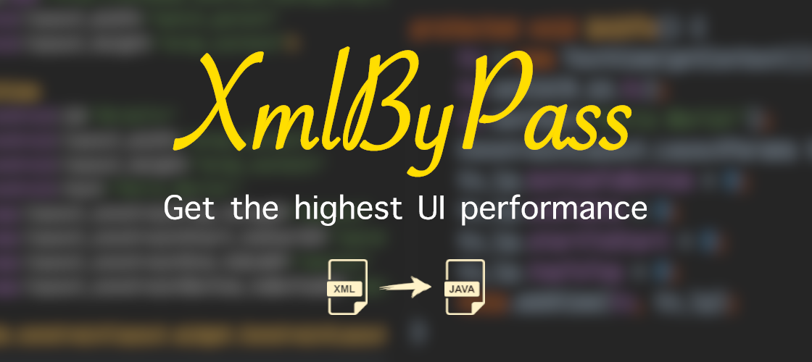
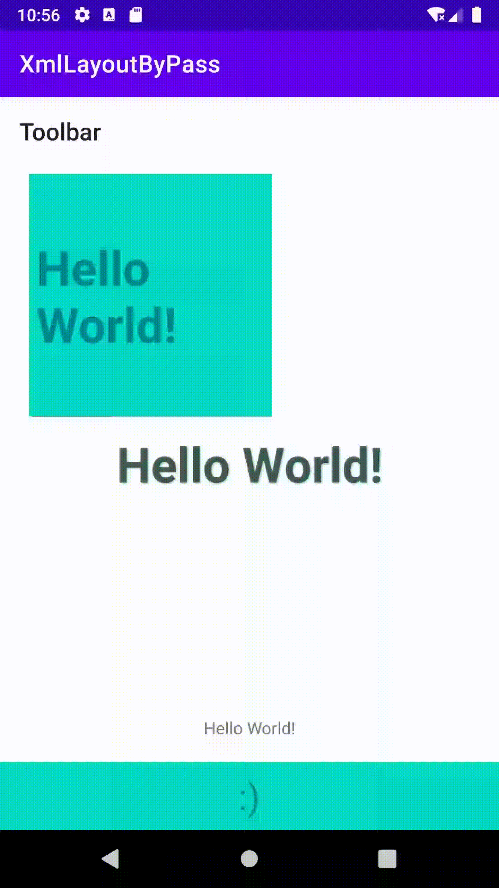
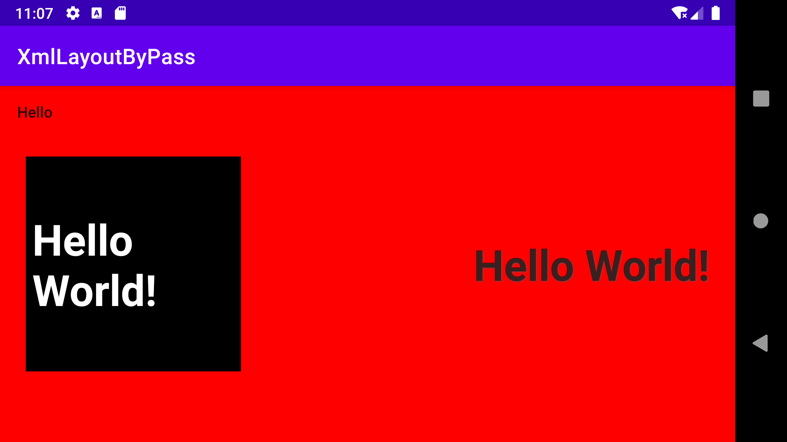

# XmlByPass
 
 
[](http://developer.android.com/index.html)
[](https://search.maven.org/artifact/io.github.aghajari/XmlByPass/1.0.1/aar)
[](https://gitter.im/Aghajari/community?utm_source=badge&utm_medium=badge&utm_campaign=pr-badge&utm_content=badge)

Get the Highest Android UI performance!

With  **XmlByPass** you won't need to learn any new thing! just use  **XmlByPass** to get the highest performance from your Xml layouts.

When i started developing android applications, i just saw that we develop almost all of the UI with Xml and that made me so unsatisfied cuase it was really really boring. So, i started creating views programmatically then i found it so enjoyable and got a better perfomance for sure. But coding programmatically to create a layout is very time consuming even for simple layouts.

and also as [Karakuri](https://stackoverflow.com/a/35569482) said: 
> Remembering which LayoutParams to use where is great mental gymnastics

But i will tell you how to do this later (If you wanted ofc)

As you may know there are so many challenges to create a layout programmatically, 
for example you need to know about qualifiers (Screen orientation, Screen size, Layout Direction, Night mode and etc.)

Android has already handled all of this with resources! [Read more](https://developer.android.com/guide/topics/resources/providing-resources)
> Almost every app should provide alternative resources to support specific device configurations. For instance, you should include alternative drawable resources for different screen densities and alternative string resources for different languages. At runtime, Android detects the current device configuration and loads the appropriate resources for your app.
> 
> 

Why should we use XML layouts?
- As i mentioned, coding programmatically to create a layout is very time consuming meanwhile one of the goals of xml was to prepare quickly.
- You can easily create a layout, even with a simple drag & drop (thanks to the Android Studio Designer tools)
- Almost all of the resources/tutorials of Android on documents/articles/source-codes are presented by **XML**
- Easy to create layouts for different configurations. (Qualifiers)

How `LayoutInflater` inflates a Layout?

Android pre-compiles every layout but still needs to hold the original xml file, why? cause needs to generate a suitable LayoutParams for container.
So, in step of inflation we are always parsing the XML by using [`XmlPullParser`](http://www.xmlpull.org/), but ofc android has written it's own customized parser with native codes (C) which makes it a little faster. Anyway, We never can ignore the fact that creating instance of views are done by reflection (`LayoutInflater#createView(Context, String, String, AttributeSet)`). And without `ViewBinding`, everytime we want to find a `View` we call `View#findViewById(int)` which needs to iterate all childs (including childs of it's child :D)

As [Andrii Drobiazko](https://medium.com/@c2q9450/performance-comparison-building-android-ui-with-code-anko-vs-xml-layout-cc0abb21c561) wrotes: 

> By default, UI in Android is built using XML layout files. it leads to overhead in cpu and ram usage. It can be insensibly for fast and powerful devices, but low-end devices may suffer from resources deficit
> 
> **Benchmark:**
> 
> 

---
<p align="center"><b>And there we go! Your savior, XmlByPass :)</b></p>

---

 ## Table of Contents  
- [Introduction](#introduction)
- [Installation](#installation)
- [Usage](#usage)
- [Qualifiers](#qualifiers)
- [ViewModel](#viewmodel)
- [Custom Attribute](#custom-attribute)
- [Performance](#performance)
- [Author](#author)
- [License](#license)
 
 ## Introduction
 
**XmlByPass** is an annotationProcessor library for Android which auto generates the java code of your xml layouts in `Source` level (before compile). That means, you can create your layouts easily and quickly with XML and get all benefits of using xml/resources meanwhile get the performance of creating views programmatically without even knowing about it! (Not joking, you don't need to learn anything new :))
 
**XmlByPass** supports almost 99% of tags and attributes of XML layouts including `<include/>` and `<fragment/>`, And for other 1%, it will auto generate style resources and applies them to the views. Therefore, you can be sure it will 100% work.

No need to worry about ViewBinding, **XmlByPass** adds views that have an `android:id` with their ID name as Public variables and other views are protected so still you can customize them by inheritance. (You will see sample codes in Usage)

**XmlByPass** supports all [qualifiers](https://developer.android.com/guide/topics/resources/providing-resources). Yay!

And one more interesting option, **XmlByPass** brings auto generating [`ViewModel`](https://developer.android.com/topic/libraries/architecture/viewmodel) with [`LiveData`](https://developer.android.com/topic/libraries/architecture/livedata) :)


 

## Installation

XmlByPass is available in the `mavenCentral()`, so you just need to add it as a dependency (Module gradle)

Java: 
```gradle
annotationProcessor 'io.github.aghajari:XmlByPass:1.0.1'
implementation 'io.github.aghajari:XmlByPassAnnotations:1.0.1'
```

Kotlin: 
```gradle
apply plugin: 'kotlin-kapt'

kapt 'io.github.aghajari:XmlByPass:1.0.1'
implementation 'io.github.aghajari:XmlByPassAnnotations:1.0.1'
```

## Usage

Let's start with Android Studio Hello World project!

This is `activity_main` (xml layout): 

```xml
<?xml version="1.0" encoding="utf-8"?>
<androidx.constraintlayout.widget.ConstraintLayout 
    xmlns:android="http://schemas.android.com/apk/res/android"
    xmlns:app="http://schemas.android.com/apk/res-auto"
    android:layout_width="match_parent"
    android:layout_height="match_parent">
    
    <TextView
        android:id="@+id/tv"
        android:layout_width="wrap_content"
        android:layout_height="wrap_content"
        android:text="Hello World!"
        app:layout_constraintBottom_toBottomOf="parent"
        app:layout_constraintLeft_toLeftOf="parent"
        app:layout_constraintRight_toRightOf="parent"
        app:layout_constraintTop_toTopOf="parent" />
    
</androidx.constraintlayout.widget.ConstraintLayout>
```

This is the MainActivity:

<details open><summary><b>Java</b></summary>
<p>
	
```java
public class MainActivity extends AppCompatActivity {
    @Override
    protected void onCreate(Bundle savedInstanceState) {
        super.onCreate(savedInstanceState);
        setContentView(R.layout.activity_main);
    }
}
```
</p></details>
<details><summary><b>Kotlin</b></summary>
<p>
	
```kotlin
class MainActivity : AppCompatActivity() {
    override fun onCreate(savedInstanceState: Bundle?) {
        super.onCreate(savedInstanceState)
        setContentView(R.layout.activity_main)
    }
}
```
</p></details>

<br>

Alright, Let's include **XmlByPass**, You won't need to change your xml layout at all! but this is gonna be how your MainActivity looks like: 

<details open><summary><b>Java</b></summary>
<p>
	
```java
import com.aghajari.xmlbypass.XmlByPass;
import com.aghajari.xmlbypass.XmlLayout;
	
@XmlByPass(layouts = {
        @XmlLayout(layout = "activity_main", className = "ActivityMain")
})
public class MainActivity extends AppCompatActivity {
    @Override
    protected void onCreate(Bundle savedInstanceState) {
        super.onCreate(savedInstanceState);
        setContentView(new ActivityMain(this));
    }
}
```
</p></details>
<details><summary><b>Kotlin</b></summary>
<p>
	
```kotlin
import com.aghajari.xmlbypass.XmlByPass
import com.aghajari.xmlbypass.XmlLayout

@XmlByPass(layouts = [
    XmlLayout(layout = "activity_main", className = "ActivityMain")
])
class MainActivity : AppCompatActivity() {
    override fun onCreate(savedInstanceState: Bundle?) {
        super.onCreate(savedInstanceState)
        setContentView(ActivityMain(this))
    }
}
```
</p></details>

<br>

**XmlByPass** will generate `ActivityMain` automatically, This is how the generated class looks like:

<details><summary><b>ActivityMain.java</b></summary>
<p>
 
```java
import android.content.Context;
import android.util.AttributeSet;
import android.widget.TextView;

import androidx.constraintlayout.widget.ConstraintLayout;

public class ActivityMain extends ConstraintLayout {

    public TextView tv;

    public ActivityMain(Context context) {
        this(context, null);
    }

    public ActivityMain(Context context, AttributeSet attrs) {
        this(context, attrs, 0);
    }

    public ActivityMain(Context context, AttributeSet attrs, int defStyleAttr) {
        super(context, attrs, defStyleAttr);

        init();
    }

    protected void init() {
        initThis();
        initTv();
    }

    protected void initThis() {
        this.setLayoutParams(new ConstraintLayout.LayoutParams(-1, -1));
    }

    protected void initTv() {
        tv = new TextView(getContext());
        tv.setId(R.id.tv);
        tv.setText("Hello World!");
        ConstraintLayout.LayoutParams tv_lp = new ConstraintLayout.LayoutParams(-2, -2);
        tv_lp.bottomToBottom = ConstraintLayout.LayoutParams.PARENT_ID;
        tv_lp.endToEnd = ConstraintLayout.LayoutParams.PARENT_ID;
        tv_lp.startToStart = ConstraintLayout.LayoutParams.PARENT_ID;
        tv_lp.topToTop = ConstraintLayout.LayoutParams.PARENT_ID;
        this.addView(tv, tv_lp);
    }

}
```
</p></details>

---
<p align="center"><b>That's it!</b></p>

---

By `@XmlLayout(layout = "*")` you can mark all layouts, So **XmlByPass** will generate a java class for each existing layout and the name of the class will be the name of it's layout file.

```java
@XmlByPass(layouts = {@XmlLayout(layout = "*")})
public class MainActivity extends AppCompatActivity {
```

By `packageName` you can set pacakgeName of generated java classes, 
Do not forget to set main package name of your app for R.class

```java
@XmlByPass(layouts = {...}, packageName = "com.example.layouts", R = "com.example")
```

By `include` you can specify whether **XmlByPass** should generate java class for included layouts or not ([`<include/>`](https://developer.android.com/training/improving-layouts/reusing-layouts), it is `true` by default)

```java
@XmlByPass(layouts = {...}, include = true)
```

By `styleable` you can specify whether **XmlByPass** should generate style resource for unknown attributes or not (it is `false` by default)

*Note:* If you enabled the styleable, you may need compile your code twice for the first time, android will load resources first, so you need a second try to import the generated style file.
```java
@XmlByPass(layouts = {...}, styleable = true)
```

By `viewModel` you can specify whether **XmlByPass** should generate a [`ViewModel`](https://developer.android.com/topic/libraries/architecture/viewmodel) class (Using [`LiveData`](https://developer.android.com/topic/libraries/architecture/livedata)) or not.

This helps you to implement [MVVM](https://www.geeksforgeeks.org/mvvm-model-view-viewmodel-architecture-pattern-in-android/) architecture easier than before, by only a single xml layout file.
```java
@XmlByPass(layouts = {
        @XmlLayout(layout = "activity_main", className = "ActivityMain", viewModel = "ActivityMainViewModel"),
}, viewModel = true)
```

## Qualifiers



This is just a simple test for [qualifiers](https://developer.android.com/guide/topics/resources/providing-resources), Two layouts are made. One for the landscape mode in `layout-land` folder, and another one for other configs in `layout` folder with same name.

This is the generated java code condition: 
```java
if (getResources().getConfiguration().orientation == Configuration.ORIENTATION_LANDSCAPE)
   init_land();
else
   init();
```

And this is the way you can customize it in code with a simple inheritance :

```java
@XmlByPass(layouts = {
        @XmlLayout(layout = "activity_main", className = "ActivityMain")
})
public class MainActivity extends AppCompatActivity {

    @Override
    protected void onCreate(Bundle savedInstanceState) {
        super.onCreate(savedInstanceState);
        setContentView(new ActivityMain(this) {
            @Override
            protected void init_land() {
                super.init_land();
                setBackgroundColor(Color.RED);
            }
        });
    }
}
```



By the way, In the example above, on bottom you can see a constraint layout with a simple TextView and a SmileView which both of them are added to the layout by `<include/>`

## ViewModel
**XmlByPass** will automatically generate ViewModels which extend `androidx.lifecycle.ViewModel` for your layout and contains some LiveData variables.

To use this feature, you must follow a specific structure in your xml so that **XmlByPass** can define variables correctly.

This structure is very simple and can be created by just adding a few tags to the views.

A quick review: 

> By `viewModel` you can specify whether **XmlByPass** should generate a [`ViewModel`](https://developer.android.com/topic/libraries/architecture/viewmodel) class (Using [`LiveData`](https://developer.android.com/topic/libraries/architecture/livedata)) or not.
>
> This helps you to implement [MVVM](https://www.geeksforgeeks.org/mvvm-model-view-viewmodel-architecture-pattern-in-android/) architecture easier than before, by only a single xml layout file.
> ```java
> @XmlByPass(layouts = {
>         @XmlLayout(layout = "activity_main", className = "ActivityMain", viewModel = "ActivityMainViewModel"),
> }, viewModel = true)
> ```

Consider the following layout:
```xml
<?xml version="1.0" encoding="utf-8"?>
<RelativeLayout xmlns:android="http://schemas.android.com/apk/res/android"
    xmlns:tools="http://schemas.android.com/tools"
    android:layout_width="match_parent"
    android:layout_height="match_parent"
    tools:context=".MainActivity">

    <TextView
        android:id="@+id/tv"
        android:layout_width="wrap_content"
        android:layout_height="wrap_content"
        android:layout_centerInParent="true"
        android:text="Hello World!"/>

</RelativeLayout>
```

Ok, now see this one:
```xml
<?xml version="1.0" encoding="utf-8"?>
<RelativeLayout xmlns:android="http://schemas.android.com/apk/res/android"
    xmlns:tools="http://schemas.android.com/tools"
    android:layout_width="match_parent"
    android:layout_height="match_parent"
    tools:context=".MainActivity">
 
    <TextView
        android:id="@+id/tv"
        android:layout_width="wrap_content"
        android:layout_height="wrap_content"
        android:layout_centerInParent="true">
     
     <tag android:id="@+id/myText" android:value="live;attr=text;Hello World!"/>
    </TextView>

</RelativeLayout>
```

We just added a tag to the TextView :
```xml
<tag android:id="@+id/myText" android:value="live;attr=text;Hello World!"/>
```

- `android:id` specifies the name of the variable
- `android:value` starts with `live;` so **XmlByPass** can undrestand this tag will be a LiveData
- `attr=text` means the target attribute is setText(String)
- `Hello World!` is the initial value of variable

The generated ViewModel:
```java
import androidx.lifecycle.LiveData;
import androidx.lifecycle.MutableLiveData;
import androidx.lifecycle.ViewModel;

public class MyViewModel extends ViewModel {

	MutableLiveData<String> myText = new MutableLiveData<>("Hello World!");

	public LiveData<String> getMyText() {
		return myText;
	}

	public void setMyText(String value) {
		myText.setValue(value);
	}

}
```

And this is how you can change data in MainActivity:
```java
MyViewModel viewModel = new ViewModelProvider(this).get(MyViewModel.class);
viewModel.setMyText("Awesome!");
```

The generated java class of your layout will automatically observe the LiveData.

**I prefer to define variables first and use them later.**
```xml
<?xml version="1.0" encoding="utf-8"?>
<RelativeLayout xmlns:android="http://schemas.android.com/apk/res/android"
    xmlns:tools="http://schemas.android.com/tools"
    android:layout_width="match_parent"
    android:layout_height="match_parent"
    tools:context=".MainActivity">
 
    <tag android:id="@+id/myText" android:value="live;type=string;Hello World!"/>
 
    <TextView
        android:id="@+id/tv"
        android:layout_width="wrap_content"
        android:layout_height="wrap_content"
        android:layout_centerInParent="true">
     
     <tag android:id="@+id/myText" android:value="live;func=setText"/>
    </TextView>

</RelativeLayout>
```

This line defines a new LiveData variable with type of `String` :
```xml
<tag android:id="@+id/myText" android:value="live;type=string;Hello World!"/>
```

And this one observes tv to myText (The variable that we just defined) and connects it to the `setText` function:
```xml
<tag android:id="@+id/myText" android:value="live;func=setText"/>
```

**Let's start using a custom type!**

Consider the following model:
```java
package com.example;

public class User {

    public String name;

    public User(String name) {
        this.name = name;
    }
}
```

And this is your xml:
```xml
<?xml version="1.0" encoding="utf-8"?>
<RelativeLayout xmlns:android="http://schemas.android.com/apk/res/android"
    xmlns:tools="http://schemas.android.com/tools"
    android:layout_width="match_parent"
    android:layout_height="match_parent"
    tools:context=".MainActivity">
 
    <tag android:id="@+id/user" android:value="live;type=com.example.User"/>
 
    <TextView
        android:id="@+id/tv"
        android:layout_width="wrap_content"
        android:layout_height="wrap_content"
        android:layout_centerInParent="true">
     
     <tag android:id="@+id/user" android:value="live;src=setText(user.name)"/>
    </TextView>

</RelativeLayout>
```

This line defines a new LiveData variable with type of `com.example.User` :
```xml
<tag android:id="@+id/user" android:value="live;type=com.example.User"/>
```

And this one observes tv to the variable and connects it to the `setText` function with the specified source:
```xml
<tag android:id="@+id/user" android:value="live;src=setText(user.name)"/>
```


So view can observe a variable in 3 ways: `src`, `func` and `attr`

## Custom Attribute

As i said before, **XmlByPass** will generate style resource for unknown attributes. but you can pre define them if you needed to by using `@XmlByPassAttr`:

For example:
```java
@XmlByPassAttr(name = "app:color", format = "color")
public class MainActivity extends AppCompatActivity {
```
This means that there is a `setColor(int)` function in the views that use this attribute

```java
@XmlByPassAttr(name = "app:color", format = "color", codeName = "backgroundColor")
```
This means that there is a `setBackgroundColor(int)` function in the views that use this attribute

```java
@XmlByPassAttr(name = "app:color", format = "color", enums = {
        @XmlByPassAttrEnum(key = "black", value = "Color.BLACK"),
        @XmlByPassAttrEnum(key = "white", value = "Color.WHITE")
})
```
This means that there is a `setColor(int)` function in the views that use this attribute and **enums** are replaced by their value.

## Performance
This library does not optimize your code, but overwrites it with Java code so that there are no more xml interfaces. If you follow the principles of designing layouts, you can be sure that you will have the highest performance :)

Follow these steps:

- Avoid adding useless parents.
- Avoid ConstraintLayout as long as you can replace it with FrameLayout or LinearLayout. ([Read more](https://medium.com/android-news/constraint-layout-performance-870e5f238100))
- Avoid nested layouts and find the best ViewGroup for your position.


## Author
Amir Hossein Aghajari

### SUPPORT ❤️
If you find this library useful, Support it by joining [**stargazers**](https://github.com/aghajari/XmlByPass/stargazers) for this repository ⭐️


License
=======

    Copyright 2022 Amir Hossein Aghajari
    Licensed under the Apache License, Version 2.0 (the "License");
    you may not use this file except in compliance with the License.
    You may obtain a copy of the License at

       http://www.apache.org/licenses/LICENSE-2.0

    Unless required by applicable law or agreed to in writing, software
    distributed under the License is distributed on an "AS IS" BASIS,
    WITHOUT WARRANTIES OR CONDITIONS OF ANY KIND, either express or implied.
    See the License for the specific language governing permissions and
    limitations under the License.

<br>
<div align="center">
  
  <br><a>Amir Hossein Aghajari</a> • <a href="mailto:amirhossein.aghajari.82@gmail.com">Email</a> • <a href="https://github.com/Aghajari">GitHub</a>
</div>
